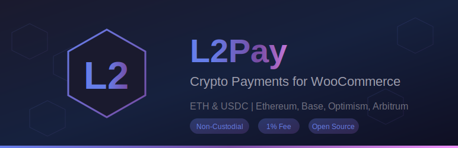

# L2Pay - Crypto Payments for WooCommerce

Accept **ETH** and **USDC** payments via MetaMask on multiple blockchains. Non-custodial, low fees, instant settlements.



## Features

- **Multi-Chain Support**: Ethereum, Base, Optimism, Arbitrum (mainnet & testnet)
- **Non-Custodial**: Payments go directly to your wallet
- **Low Fees**: Only 1% platform fee
- **Instant Settlements**: No waiting for payment processors
- **On-Chain Verification**: Every payment verified on blockchain
- **MetaMask Integration**: Seamless customer experience

## Supported Networks

### Mainnet (Live Mode)
| Network | Native Token | Stablecoin |
|---------|-------------|------------|
| Ethereum | ETH | USDC |
| Base | ETH | USDC |
| Optimism | ETH | USDC |
| Arbitrum | ETH | USDC |

### Testnet (Test Mode)
| Network | Native Token | Stablecoin |
|---------|-------------|------------|
| Sepolia | ETH | MockUSDC |
| Base Sepolia | ETH | MockUSDC |
| Optimism Sepolia | ETH | MockUSDC |
| Arbitrum Sepolia | ETH | MockUSDC |

## Requirements

- WordPress 5.8+
- WooCommerce 5.0+
- PHP 7.4+
- SSL Certificate (HTTPS)

## Installation

### From GitHub Release

1. Download the latest release ZIP
2. Go to WordPress Admin → Plugins → Add New → Upload Plugin
3. Upload the ZIP file and activate

### Manual Installation

```bash
cd wp-content/plugins/
git clone https://github.com/YOUR_USERNAME/l2pay.git
```

Then activate from WordPress admin.

## Configuration

1. Go to **WooCommerce → Settings → Payments → L2Pay**
2. Enable the gateway
3. Enter your **wallet address** (where you'll receive payments)
4. Choose **Test Mode** or **Live Mode**
5. Save changes

## How It Works

```
Customer                    Smart Contract              Merchant
    │                            │                         │
    ├─── Select ETH/USDC ───────►│                         │
    │                            │                         │
    ├─── Confirm in MetaMask ───►│                         │
    │                            │                         │
    │                            ├─── Transfer funds ─────►│
    │                            │    (minus 1% fee)       │
    │                            │                         │
    │◄── Order confirmed ────────┤                         │
```

## Security

- **Immutable Smart Contract**: Code cannot be changed after deployment
- **Reentrancy Protection**: OpenZeppelin ReentrancyGuard
- **On-Chain Verification**: Payments verified before order completion
- **Replay Attack Protection**: Unique payments per chain
- **Open Source**: All contracts verified on block explorers

### Smart Contract Addresses

**Mainnet** (same address on all networks):
```
0x84f679497947f9186258Af929De2e760677D5949
```

**Testnet**:
| Network | Contract Address |
|---------|-----------------|
| Sepolia | `0x027811E894b6388C514f909d54921a701337f467` |
| Base Sepolia | `0xF0DCC0C62587804d9c49B075d24725A9a6eA2c6E` |
| Optimism Sepolia | `0x3E9334D16A57ADC0cAb7Cea24703aC819c1DAB8D` |
| Arbitrum Sepolia | `0xC5913aE49d6C52267B58824297EC36d36c27740d` |

## Translations

Available in:
- English (default)
- Italiano (it_IT)
- Deutsch (de_DE)
- Français (fr_FR)
- Español (es_ES)

## Development

### Project Structure

```
l2pay/
├── l2pay.php              # Main plugin file
├── readme.txt             # WordPress readme
├── LICENSE                # GPL-2.0
├── includes/
│   ├── class-l2pay-gateway.php    # Payment gateway
│   └── class-l2pay-api.php        # REST API endpoints
├── assets/
│   ├── js/l2pay-checkout.js       # Frontend JavaScript
│   ├── css/l2pay.css              # Styles
│   └── images/                    # Logos & icons
└── languages/             # Translation files (.mo)
```

### Testing

1. Enable **Test Mode** in settings
2. Get testnet ETH from faucets:
   - [Sepolia Faucet](https://sepoliafaucet.com/)
   - [Base Sepolia Faucet](https://www.coinbase.com/faucets/base-ethereum-sepolia-faucet)
3. Make a test purchase

## Contributing

Contributions are welcome! Please:

1. Fork the repository
2. Create a feature branch (`git checkout -b feature/amazing-feature`)
3. Commit your changes (`git commit -m 'Add amazing feature'`)
4. Push to the branch (`git push origin feature/amazing-feature`)
5. Open a Pull Request

## License

This project is licensed under the GPL v2 or later - see the [LICENSE](LICENSE) file for details.

## Support

- **Issues**: [GitHub Issues](https://github.com/YOUR_USERNAME/l2pay/issues)
- **Documentation**: [Wiki](https://github.com/YOUR_USERNAME/l2pay/wiki)

## Changelog

### 1.0.0
- Initial release
- Multi-chain support (Ethereum, Base, Optimism, Arbitrum)
- ETH and USDC payments
- MetaMask integration
- On-chain verification
- 4 language translations

---

Made with ❤️ for the crypto community
